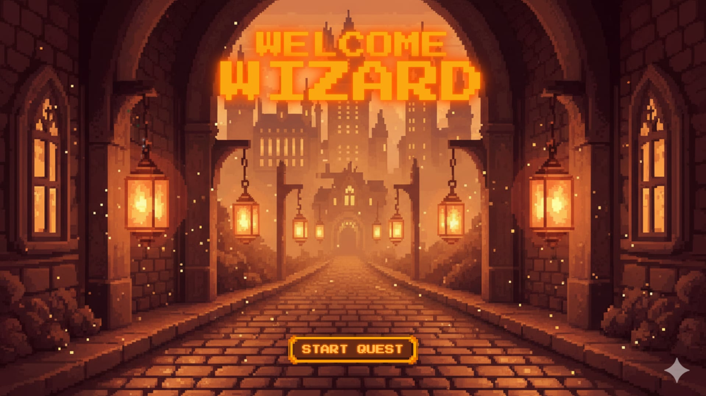
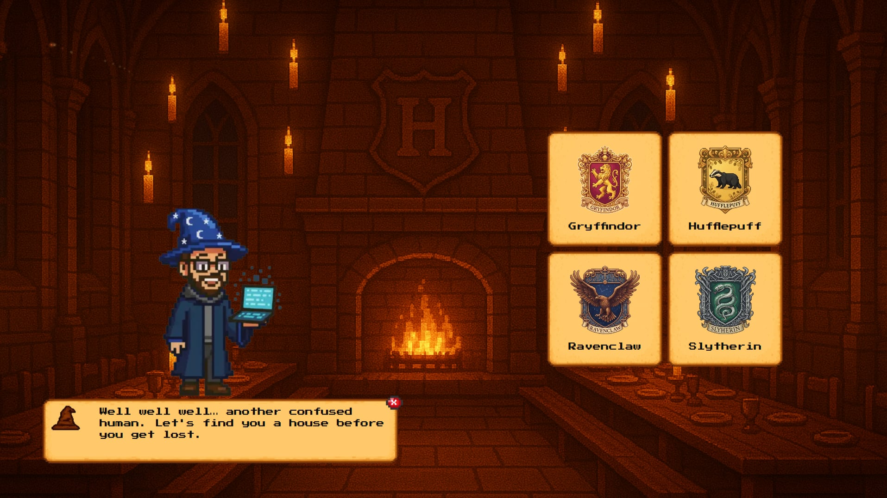
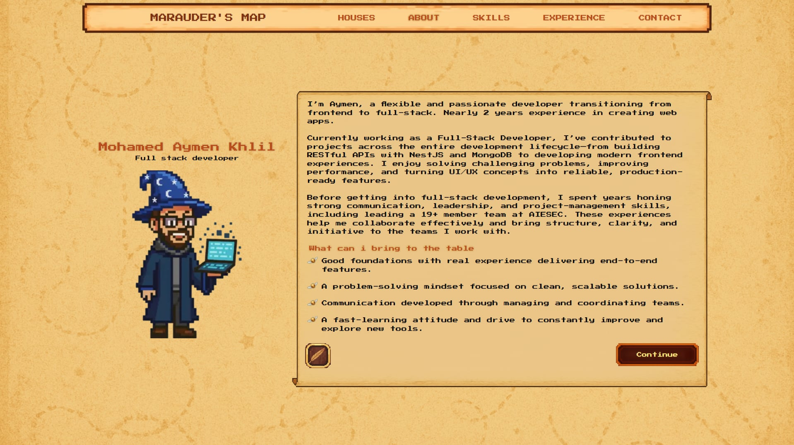

<h2 align="center">✨ The Pixel Wizard Portfolio ✨</h2>
<p align="center"><i align="center"> A pixel-enchanted portfolio where owls deliver messages, scrolls hold secrets, and your cursor might actually be a wand. </i></p>


<h4 align="center">
<a href="">
    
  </a>
  <a href="">
    
  </a>
  <a href="">
    
  </a>
  <br>
  <a href="">
    
  </a>
  <a href="">
    
  </a>
  <a href="">
    
  </a>
  <a href="">
    
  </a>
  <br>
   <a href="">
    
  </a>
</h4>

<p align="center">
    
</p>

## 🧙‍♂️ About This Project
Welcome to the Pixel Wizard Portfolio, a magically cursed (in the best possible way) developer portfolio built with a fusion of modern web technologies and Hogwarts-inspired pixel art enchantments.

This project began as soon as I started learning Framer Motion, what started as a simple animation experiment quickly transformed into a full wizarding-themed interactive portfolio.
Step by step, spell by spell, I kept adding new ideas and features as I learned them. The project is still evolving and far from “complete,” but that’s exactly the point: it reflects my journey as a developer who’s always learning, improving, and crafting something better with each iteration.

Clean, responsive and playful this portfolio is both a technical showcase and a magical experience.

## ✨ Features

<details>
<summary>
  🧙 Magical UI & Pixel Art
</summary>

- Custom pixel owls, scrolls, wax seals, sparkles
- Wooden desk backgrounds & parchment textures
- Harry-Potter-themed house buttons
- Pixel-art smooth animations and transitions

</details>

<details>
<summary>
  🦉 “Send an Owl” Contact Experience
</summary>

- Rune-labeled scroll inputs
- Wax seal submit button
- Friendly validation using RHF + Zod

</details>

<details>
<summary>
  ⚡ Technical Stack
</summary>

- Next.js for frontend
- TypeScript for safe magic
- TailwindCSS for quick styling
- Framer Motion for animations
- React Hook Form + Zod for validation
- Zustand as lightweight state management
  
</details>

## 🖼️ Screenshots
<details open>
<summary>
 Some screenshots
</summary> <br />

<p align="center">
    
&nbsp;
    
</p>

</details>

## 🚀 Live Demo
🔮 Visit the magic portal:
👉 [Visit website](https://the-pixel-wizard-portfolio.vercel.app/)

## 🛠️ Installation & Setup

```bash
git clone https://github.com/your-username/the-owlery-portfolio.git
cd the-owlery-portfolio
npm install
npm run dev
```

## 📬 Contact
- 🦉 Send an Owl → via contact form
- 📧 Email → aymen-khlil@outlook.com
- 💼 [LinkedIn](https://www.linkedin.com/in/mohamed-aymen-khlil-467840179/)
- 🐙 [Github](https://github.com/Aymen-khlil)

## 📝 License 

This project is licensed under the GNU General Public License v3 (GPLv3).


Copyright © 2025, Aymen Khlil

Under this license:

- ✔ You are free to use, modify, and distribute this project
- ✔ Any changes you make must remain open source under the same GPLv3 license
- ✔ If you distribute a modified version, you must also provide the source code
- ❌ You cannot make a closed-source or proprietary version
- ❌ You cannot sublicense the project under a non-GPL license

For the full terms, see the official license text:
https://www.gnu.org/licenses/gpl-3.0.txt
